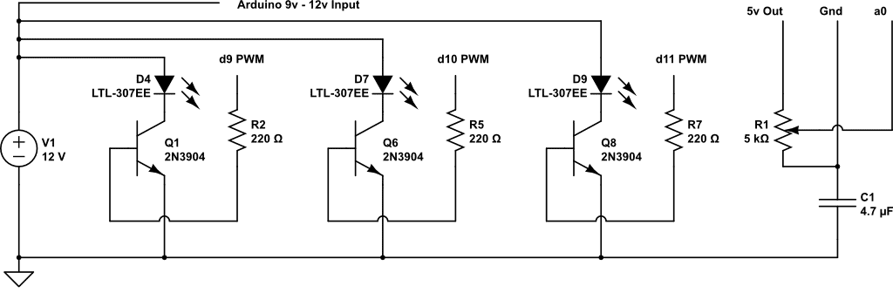

# 4 Seasons Color Fading Loop for Ultra Bright RGB LEDs

Project for Hui's Childrens Hospital Display Lighting to go above 4 seasons minature exhibit.

This a script used in conjunction with a custom shield I built for Arduino. The schematic for the shield that goes along with this code is located at the link here: [https://www.circuitlab.com/circuit/f48fgf/arduino-rgb-led-rainbow-fade/](https://www.circuitlab.com/circuit/f48fgf/arduino-rgb-led-rainbow-fade/) or below as PNG:

fabricated for artist: http://huiytsai.com

Maintained by: hello@jonathangrover.com